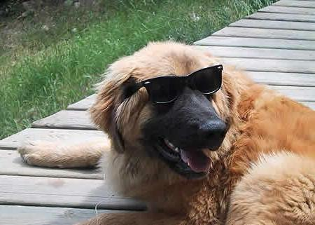
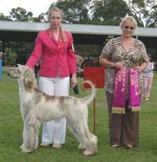
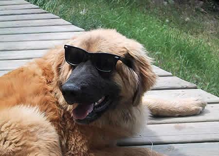

[ LinkedIn](https://www.linkedin.com/in/AnthonyArmoursProfile)

# Image Data Augmentation
In the world of machine learning, overfitting is a common problem for deep neural networks.
Neural networks are uncannily versitile; however they are can be easily overparameterized given
the sizes of todays datasets. This results in a model that, rather than learning the proper signals, learns the noise within 
the dataset. In this case, the model essentially memorizes unimportant properties of the dataset instead of learning
the meaningful components and general information about the data. Overfit networks fail to produce useful results given 
new real-world data. Data augmentation is a useful data engineering technique that helps prevent overfitting and can also 
"stretch" a dataset. In this project I have implemented 6 different image data augmentation methods using tensorflow.

---

## Dependencies
| Library/Framework  | Version |
| ------------------ | ------- |
| Python             | ^3.7.3  |
| tensorflow         | ^2.6.0  |

---

### [Flip]( "Flip")
Flips an image horizontally.

Before Flip             |  After Flip
:-------------------------:|:-------------------------:
  |  

``` python
import tensorflow as tf


def flip_image(image):
    """
    Flips an image horizontally.

    Args:
        image: tf.Tensor - Image to flip.

    Return: tf.Tensor - Flipped image.
    """
    return tf.image.flip_left_right(image)


if __name__ == "__main__":
    import tensorflow_datasets as tfds
    from tensorflow.keras.utils import save_img

    tf.compat.v1.enable_eager_execution()
    tf.compat.v1.set_random_seed(0)

    doggies = tfds.load('stanford_dogs', split='train', as_supervised=True)
    for image, _ in doggies.shuffle(10).take(1):
        save_img("./images/before_flip.jpg", image)
        save_img("./images/flip.jpg", flip_image(image))
```

---

### [Crop]( "Crop")
Computes a random crop of an image.

Before Crop             |  After crop
:-------------------------:|:-------------------------:
  |  

``` python
import tensorflow as tf


def crop_image(image, size):
    """
    Computes random crop of an image.

    Args:
        image: tf.Tensor - Image to crop.
        size: tuple - size of crop

    Return: tf.Tensor - Cropped image.
    """
    return tf.image.random_crop(image, size)


if __name__ == "__main__":
    import tensorflow_datasets as tfds
    from tensorflow.keras.utils import save_img

    tf.compat.v1.enable_eager_execution()
    tf.compat.v1.set_random_seed(1)

    doggies = tfds.load('stanford_dogs', split='train', as_supervised=True)
    for image, _ in doggies.shuffle(10).take(1):
        save_img("./images/before_random_crop.jpg", image)
        save_img("./images/random_crop.jpg", crop_image(image, (200, 200, 3)))
```

---

### [Rotate]( "Rotate")
Rotates an image 90 degrees counter-clockwise.

Before Rotation             |  After Rotation
:-------------------------:|:-------------------------:
  |  

``` python
import tensorflow as tf


def rotate_image(image):
    """
    Rotates an image 90 degrees counter-clockwise.

    Args:
        image: tf.Tensor - Image to rotate.

    Return: tf.Tensor - rotated image.
    """
    return tf.image.rot90(image)


if __name__ == "__main__":
    import tensorflow_datasets as tfds
    from tensorflow.keras.utils import save_img

    tf.compat.v1.enable_eager_execution()
    tf.compat.v1.set_random_seed(2)

    doggies = tfds.load('stanford_dogs', split='train', as_supervised=True)
    for image, _ in doggies.shuffle(10).take(1):
        save_img("./images/before_rotation.jpg", image)
        save_img("./images/rotation.jpg", rotate_image(image))
```

---

### [Shear]( "Shear")
Computes a random shear of an image.

Before Shear             |  After Shear
:-------------------------:|:-------------------------:
  |  

``` python
import tensorflow as tf
from tensorflow.python.ops.numpy_ops import np_config
np_config.enable_numpy_behavior()


def shear_image(image, intensity):
    """
    Randomly shears an image.

    Args:
        image: tf.Tensor - Image to shear.
        intensity: Shear intensity.

    Return: tf.Tensor - sheared image.
    """
    shear = tf.keras.preprocessing.image.random_shear
    return shear(image, intensity, row_axis=0, col_axis=1, channel_axis=2)


if __name__ == "__main__":
    import tensorflow_datasets as tfds
    from tensorflow.keras.utils import save_img

    tf.compat.v1.enable_eager_execution()
    tf.compat.v1.set_random_seed(3)

    doggies = tfds.load('stanford_dogs', split='train', as_supervised=True)
    for image, _ in doggies.shuffle(10).take(1):
        save_img("./images/before_shear.jpg", image)
        save_img("./images/shear.jpg", shear_image(image, 50))
```

---

### [Brightness]( "Brightness")
Randomly changes the brightness of an image.

Before Brightness Change             |  After Brightness Change
:-------------------------:|:-------------------------:
  |  

``` python
import tensorflow as tf


def change_brightness(image, max_delta):
    """
    Randomly changes brightness of an image.

    Args:
        image: tf.Tensor - Image to change.
        max_delta: maximum amount the image should be
        brightened (or darkened).

    Return: tf.Tensor - Changed image.
    """
    return tf.image.random_brightness(image, max_delta)


if __name__ == "__main__":
    import tensorflow_datasets as tfds
    from tensorflow.keras.utils import save_img

    tf.compat.v1.enable_eager_execution()
    tf.compat.v1.set_random_seed(4)

    doggies = tfds.load('stanford_dogs', split='train', as_supervised=True)
    for image, _ in doggies.shuffle(10).take(1):
        save_img("./images/before_brightness.jpg", image)
        save_img("./images/brightness.jpg", change_brightness(image, 0.3))
```

---

### [Hue]( "Hue")
Changes the hue of an image.

Before Hue Change             |  After Hue Change
:-------------------------:|:-------------------------:
  |  

``` python
import tensorflow as tf


def change_hue(image, delta):
    """
    Changes the hue of an image.

    Args:
        image: tf.Tensor - Image to change.
        max_delta: amount the hue should change.

    Return: tf.Tensor - Changed image.
    """
    return tf.image.adjust_hue(image, delta)


if __name__ == "__main__":
    import tensorflow_datasets as tfds
    from tensorflow.keras.utils import save_img

    tf.compat.v1.enable_eager_execution()
    tf.compat.v1.set_random_seed(5)

    doggies = tfds.load('stanford_dogs', split='train', as_supervised=True)
    for image, _ in doggies.shuffle(10).take(1):
        save_img("./images/before_hue.jpg", image)
        save_img("./images/hue.jpg", change_hue(image, -0.5))
```

---

